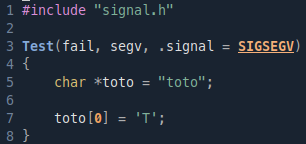

# Cheatsheet

The 2 main assertions provided by Criterion are **cr_assert_XX** and **cr_expect_XX**.

An cr_expect will continue even if one assertion fail in test which I don't recommended where an cr_assert will mark the test as failed and go to the next one.

### Common assertions

Those assertions are the basic ones.

They are mostly used for int tests.

Here is a list of available assertions:

| Assertion | Purpose | Description |
| --------- | :-----: | ---------- |
| cr_assert_null(value) | value == null | Check if actual is null depending of its type | 
| cr_assert_not_null(value) | value != null | Check if actual is not null depending of its type |
| cr_assert_eq(actual, expected) | actual == expected | Check if actual is equal to expected | 
| cr_assert_neq(actual, expected) | actual != expected | Check if actual is not equal to expected | 
| cr_assert_lt(actual, expected) | actual < expected | Check if actual is lower to expected | 
| cr_assert_leq(actual, expected) | actual <= expected | Check if actual is lower or equal to expected | 
| cr_assert_gt(actual, expected) | actual > expected | Check if actual is greater to expected | 
| cr_assert_geq(actual, expected) | actual >= expected | Check if actual is greater or equal to expected | 

 

### String assertions

The specification "str_" must be added to the assertion.

For example "cr_assert_eq()" will become "cr_assert_str_eq()" to check equality between strings.

Here is a list of available assertions:

| Assertion | Purpose | Description |
| --------- | :-----: | -------- |
| cr_assert_str_empty(actual) | actual == ""| Check if string actual is empty |
| cr_assert_str_not_empty(actual) | actual != "" | Check if actual is not empty | 
| cr_assert_str_eq(actual, expected) | actual == expected | Check if actual is equal to expected | 
| cr_assert_str_neq(actual, expected) | actual != expected | Check if actual is not equal to expected | 
| cr_assert_str_lt(actual, expected) | actual < expected | Check if actual is lower to expected | 
| cr_assert_str_leq(actual, expected) | actual <= expected | Check if actual is lower or equal to expected | 
| cr_assert_str_gt(actual, expected) | actual > expected | Check if actual is greater to expected | 
| cr_assert_str_geq(actual, expected) | actual >= expected | Check if actual is greater or equal to expected | 
| cr_assert_stdout_eq_str(value) | value == stdout | Check if value is equal to the curent stdout of the test |

 

### Useful Criterion tools

| Name | Description |
| ---- | ----------- |
| .init = &fptr | Must be added to the prototype. Execute the fptr passed before the test |
| .fini = &fptr | Must be added to the prototype. Execute the fptr passed after the test |
| .signal = SIGNAL | Specify the SIGNAL to catch in a test |
| cr_log_info(message) | Display a message as an info type, not displayed unless `--verbose` is specified |
| cr_log_warn(message) | Display a message as a warning type |
| cr_log_error(message) | Display a message as an error type |
| cr_redirect_stdout() | Redirect every stdout in the test |
| cr_redirect_sterr() | Redirect every stdout in the test |

### Examples:

#### .init / .fini

Result:

#### .signal

 

## Compile flags

Here is a list of useful flags you can add to your executable file:

| Flag | Description |
| ---- | ----------- |
| -h | Display helping informations | 
| -v | Display the current version of Criterion |
| -l | Display the list of the different suites and tests executed |
| -S | Display short named files |
| --verbose | Display every prints generated by Criterion (very recommended) |
| --debug=[tool] | Start the tests while using a debugging server attached (gdb...) |
