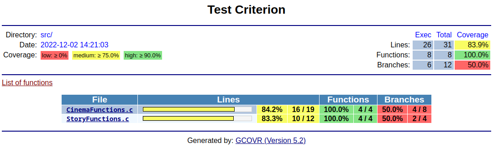

# Exercise 3

The purpose of this exercise is to automate the previous tests via a makefile and for them to be executed by the Epitech's Automated Tests.

 

## Makefile

#### In The file `Makefile` write some rules for the tests to be automatic.

- In order to execute the tests within the Automated Tests the rule must be named "tests_run". Write a rule which will compile every tests and exectute them.

- Then to have a trace of your work you must generate coverage. Using criterion create the corresponding .gnco / .gcda files of your tests.

- Tests are important but display your current lines and branches coverage of your code is also very important. Using gcovr add a rule named `coverage` which will display those informations.

- A fancy feature of gcovr is to create a web overview of your current code. By using the [cheatsheet](../Cheatsheet.md) add a rule named `html` which generate your own page.

